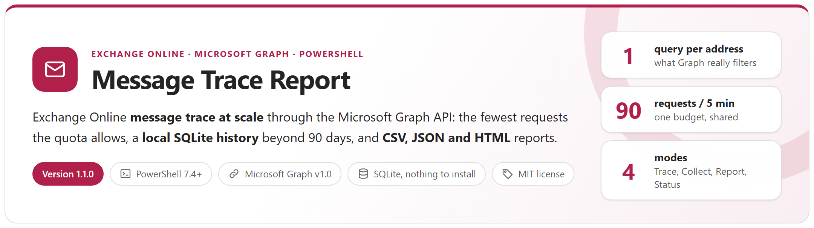
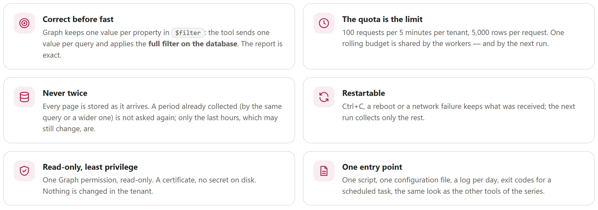
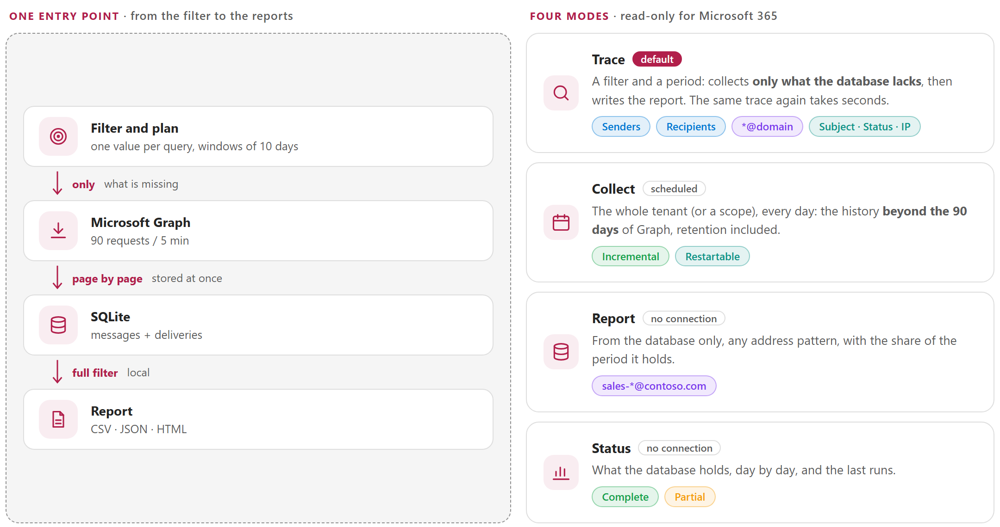
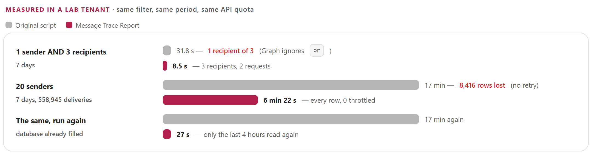
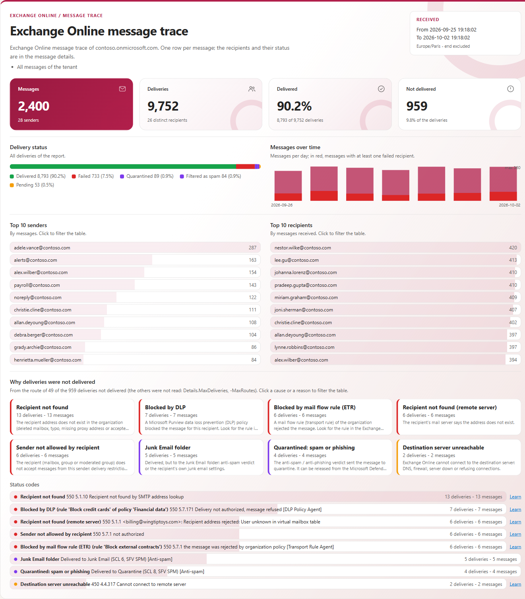
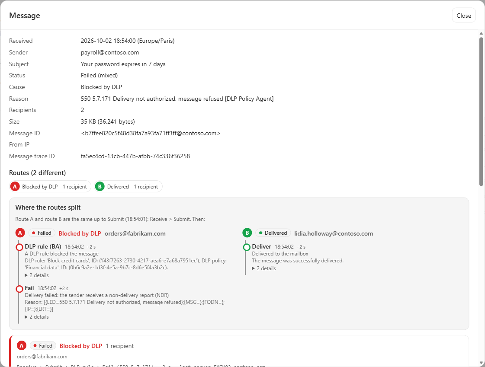
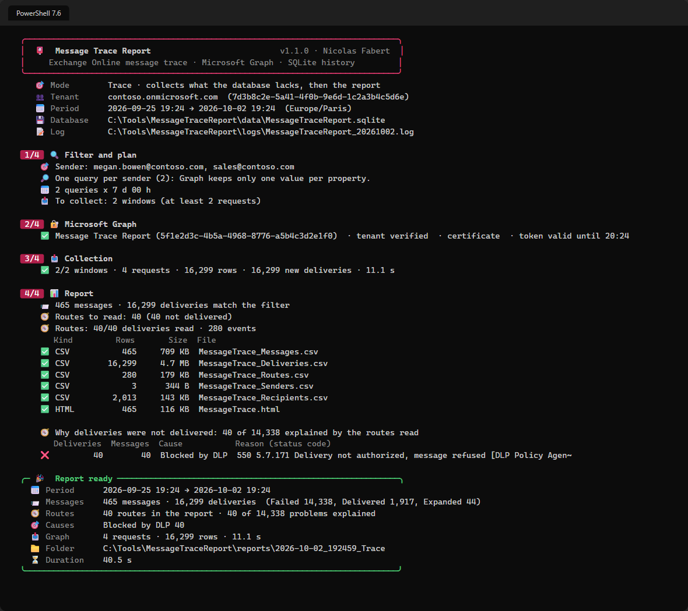
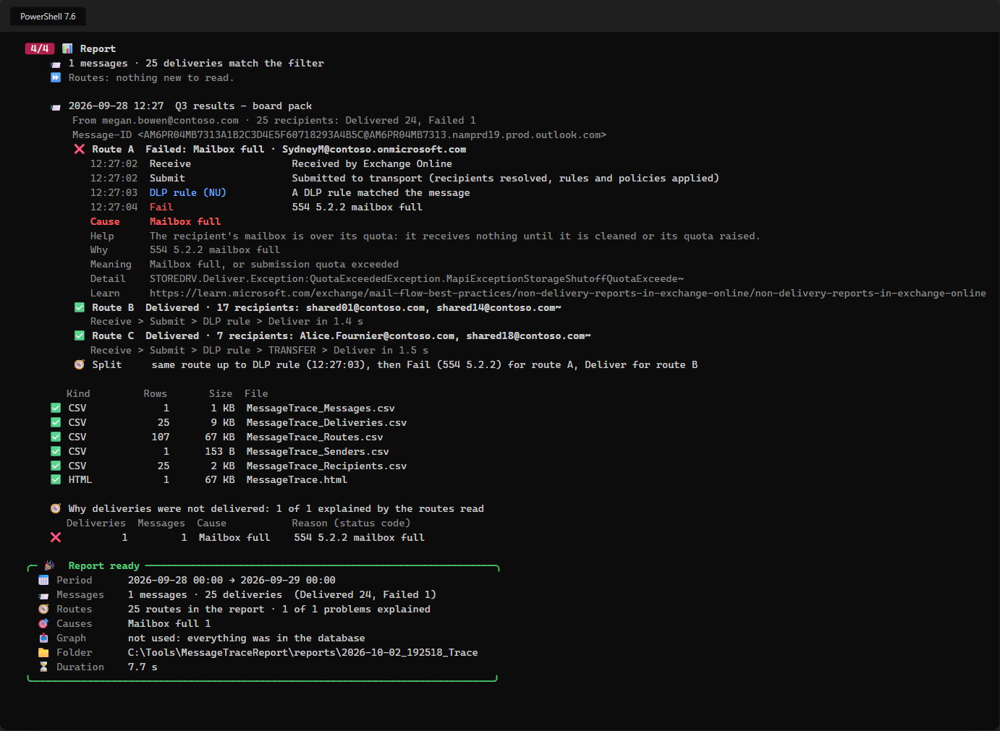

<p align="center">
  <picture>
    <source media="(prefers-color-scheme: dark)" srcset="docs/images/readme-banner-dark.png">
    
  </picture>
</p>

<p align="center">
  <a href="#why"><b>Why</b></a> &nbsp;&middot;&nbsp;
  <a href="#how-it-works"><b>How it works</b></a> &nbsp;&middot;&nbsp;
  <a href="#before--after"><b>Before / after</b></a> &nbsp;&middot;&nbsp;
  <a href="#reports"><b>Reports</b></a> &nbsp;&middot;&nbsp;
  <a href="#quick-start"><b>Quick start</b></a> &nbsp;&middot;&nbsp;
  <a href="docs/MessageTraceReport-Guide.md"><b>Administrator guide</b></a>
</p>

> [!IMPORTANT]
> Files downloaded from the Internet may be blocked by Windows and fail to run. Before using this project, unblock every file in the downloaded folder:
>
> ```powershell
> Get-ChildItem "C:\Chemin\Du\Dossier" -Recurse -File -Force | Unblock-File
> ```
>
> Replace the example path with the folder where you downloaded or extracted this project.

## Why

The **Microsoft Graph message trace API** traces Exchange Online messages without a PowerShell session — but within strict rules: **100 requests per 5 minutes for the whole tenant**, windows of 10 days, 90 days of history. And one rule it does not document: in `$filter` it keeps **one value per property** and silently ignores `or` — a query for three recipients returns only the last one. This tool plans its requests around these rules, keeps everything it receives in a **local SQLite database**, and never asks twice for what it already holds.

<picture>
  <source media="(prefers-color-scheme: dark)" srcset="docs/images/readme-principles-dark.png">
  
</picture>

## How it works

<picture>
  <source media="(prefers-color-scheme: dark)" srcset="docs/images/readme-how-it-works-dark.png">
  
</picture>

- **One query per address of the shorter list** (senders AND recipients), or per address (OR): the other conditions are applied on the database, so the report is exact. `*@domain`, subject, status, message ID and IP addresses are supported.
- **One shared rolling budget** of 90 requests per 5 minutes (configurable), `Retry-After` honoured, token renewed, network errors retried — and the requests of the last 5 minutes are remembered by the next run.
- **Page by page into SQLite**: Ctrl+C or a failure keeps what was received; the next run collects only the rest. A period already collected by the same or a wider query is not asked again; only the last hours, which may still change, are.
- **`-Mode Collect`** every day keeps the whole tenant beyond the 90 days of Graph; `-Mode Report` answers from the database only, with any address pattern.
- **Why a message was not delivered**: with `-IncludeDetails` the route of each recipient is read and explained — *Blocked by DLP*, *Blocked by mail flow rule (ETR)*, *Recipient not found*, *Mailbox full*, *Quarantined*, *Rejected by remote server*… with the rule, the status code and its Microsoft Learn page, and **where the route of a failed recipient left the route of the delivered ones**.
- **Read-only**, one permission (`ExchangeMessageTrace.Read.All`), certificate authentication built in — no module to install, SQLite bundled.

## Before / after

`Invoke-MessageTraceGraph.ps1`, the script this tool replaces, against Message Trace Report on the same lab tenant:

<picture>
  <source media="(prefers-color-scheme: dark)" srcset="docs/images/readme-benchmark-dark.png">
  
</picture>

## Reports

<table>
  <tr>
    <td width="50%" valign="top"><a href="docs/images/report-overview-light.png"></a><br><sub><b>HTML report</b> &middot; tiles, delivery status, messages over time, top senders and recipients, why deliveries were not delivered</sub></td>
    <td width="50%" valign="top"><a href="docs/images/report-message.png"></a><br><sub><b>A message</b> &middot; recipients grouped by route, where the routes split, the cause and the rule</sub></td>
  </tr>
  <tr>
    <td width="50%" valign="top"><a href="docs/images/console-trace.png"></a><br><sub><b>Console</b> &middot; plan, Microsoft Graph, collection with a live progress line, files</sub></td>
    <td width="50%" valign="top"><a href="docs/images/console-route.png"></a><br><sub><b>One message</b> &middot; one recipient failed, the others delivered: why, and where the routes split</sub></td>
  </tr>
</table>

Each run writes `Messages.csv` (one row per message), `Deliveries.csv` (one row per message and recipient, what Graph returns, with the route, cause and reason when read), `Routes.csv` (one row per step of the routes read), `Senders.csv` and `Recipients.csv` (per day), optionally JSON with the Graph property names, and a self-contained HTML report that stays fast with 200,000 messages.

## Requirements

| Item | Requirement |
|---|---|
| PowerShell | 7.4 or later, Windows |
| Modules | None (certificate or secret). Interactive sign-in: `Microsoft.Graph.Authentication` |
| Permission | Microsoft Graph `ExchangeMessageTrace.Read.All` with admin consent |
| Tenant | The service principal of the Microsoft application `8bd644d1-64a1-4d4b-ae52-2e0cbf64e373` ([guide, chapter 7](docs/MessageTraceReport-Guide.md#7-application-registration)) |
| SQLite | Bundled in `lib\sqlite` — nothing to install |

## Quick start

```powershell
git clone https://github.com/Nico77600/MessageTraceReport.git
cd MessageTraceReport
notepad .\config\MessageTraceReport.config.psd1        # TenantId, AppId, CertificateThumbprint

.\Invoke-MessageTraceReport.ps1 -Sender john@contoso.com                          # last 48 hours
.\Invoke-MessageTraceReport.ps1 -Recipient *@fabrikam.com -Status Failed -Range Last7Days -Open
.\Invoke-MessageTraceReport.ps1 -SenderFile .\vip.csv -Recipient *@gmail.com -Start 2026-09-01 -End 2026-10-01
.\Invoke-MessageTraceReport.ps1 -Sender alerts@contoso.com -Recipient helpdesk@contoso.com -Operator Or -IncludeDetails
.\Invoke-MessageTraceReport.ps1 -MessageId '<CAJ1234@mail.contoso.com>' -Range Last10Days -IncludeDetails   # why each recipient got it or not
.\Invoke-MessageTraceReport.ps1 -Mode Collect                                     # scheduled task, whole tenant
.\Invoke-MessageTraceReport.ps1 -Mode Report -Range Last30Days -Sender 'sales-*@contoso.com'
.\Invoke-MessageTraceReport.ps1 -Mode Status
```

Coming from `Invoke-MessageTraceGraph.ps1`? Its parameter names are kept as aliases (`-StartDate`, `-Senders`, `-RecipientsCsv` …): see the [migration table](docs/MessageTraceReport-Guide.md#14-migrating-from-invoke-messagetracegraphps1). The zip of each [release](https://github.com/Nico77600/MessageTraceReport/releases) contains only the files needed to run, with the HTML guide.

## Documentation

The **administrator guide** covers what the Graph API really does, the performance figures, the application registration, every setting, tracing, scheduled collection, the reports, the migration from the original script, troubleshooting and the internals:

- [docs/MessageTraceReport-Guide.md](docs/MessageTraceReport-Guide.md)
- `docs/MessageTraceReport-Guide.html` — the same guide as a single HTML file (download it and open it locally)

## Tests

```powershell
Invoke-Pester -Path .\tests          # Pester 5+, in-memory Graph API, no connection to Microsoft 365
.\tests\New-DemoReport.ps1 -Open     # a report of fictitious Contoso data, through the real engine
```

`tools\Build-Documentation.ps1` rebuilds the HTML guide; `tools\New-ReadmeImages.ps1` renders the graphics of this page from the guide, in a light and a dark version.

## License

[MIT](LICENSE). The bundled SQLite components keep their own licenses: see [THIRD-PARTY-NOTICES.md](THIRD-PARTY-NOTICES.md).

## Disclaimer

Personal project, provided as is. It is not an official Microsoft product and is not supported by Microsoft. Test it in your environment before production use.
