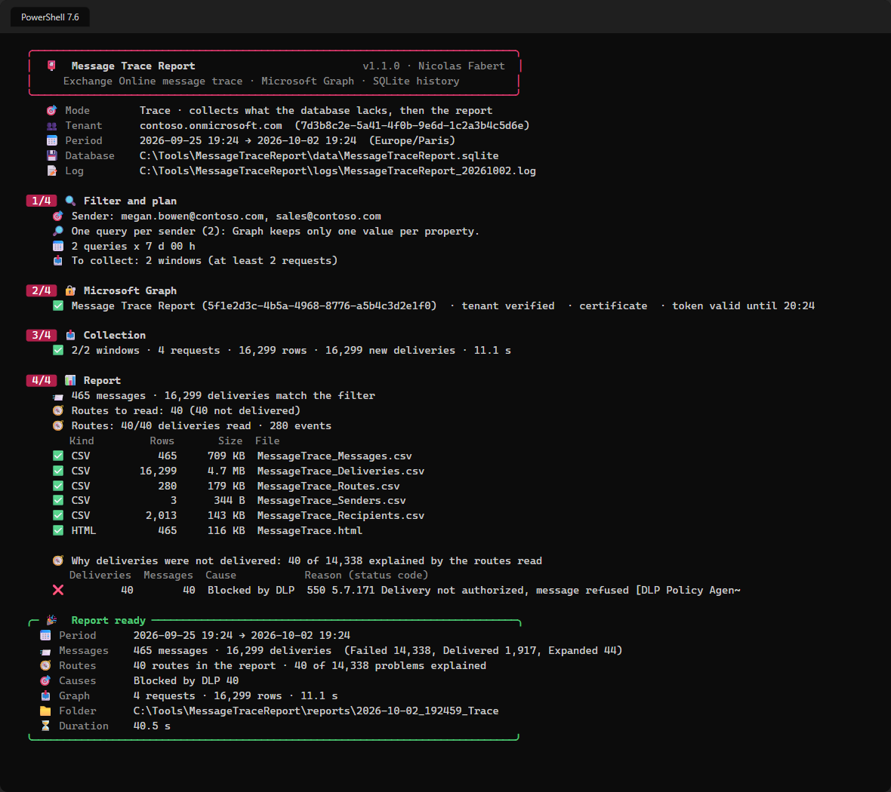
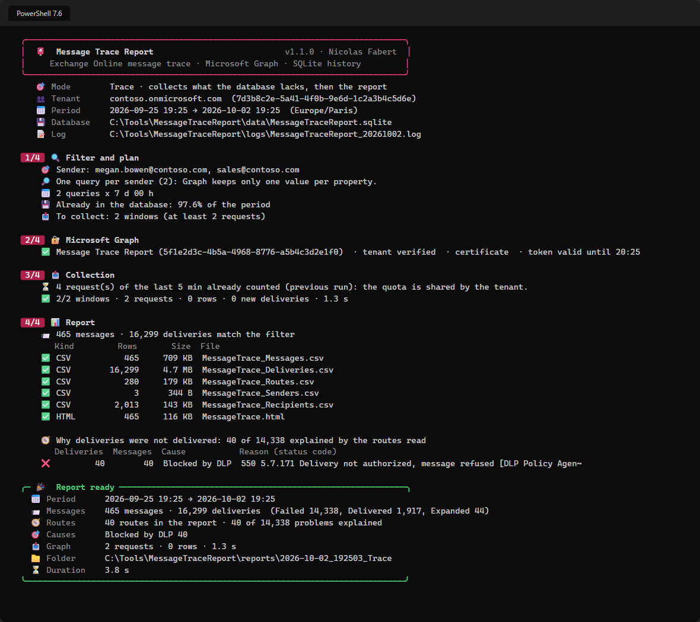
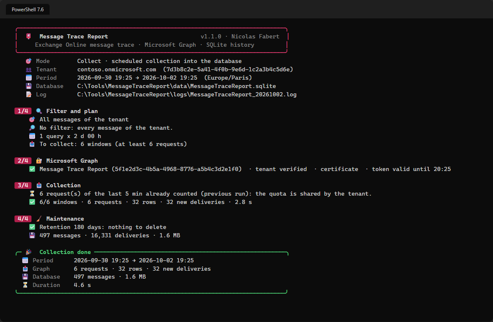
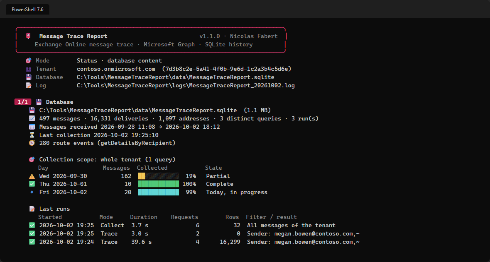
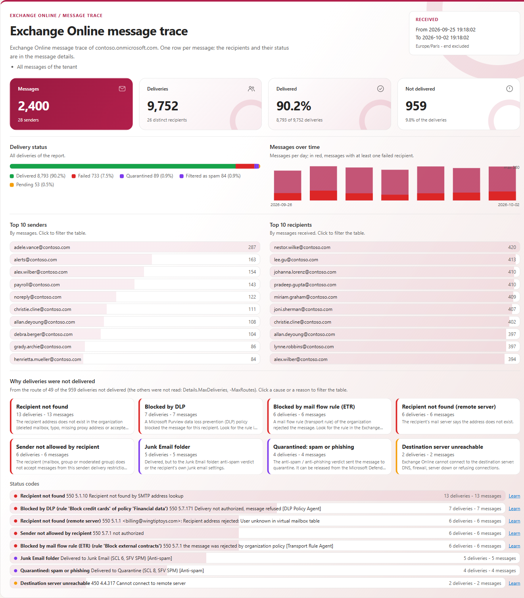
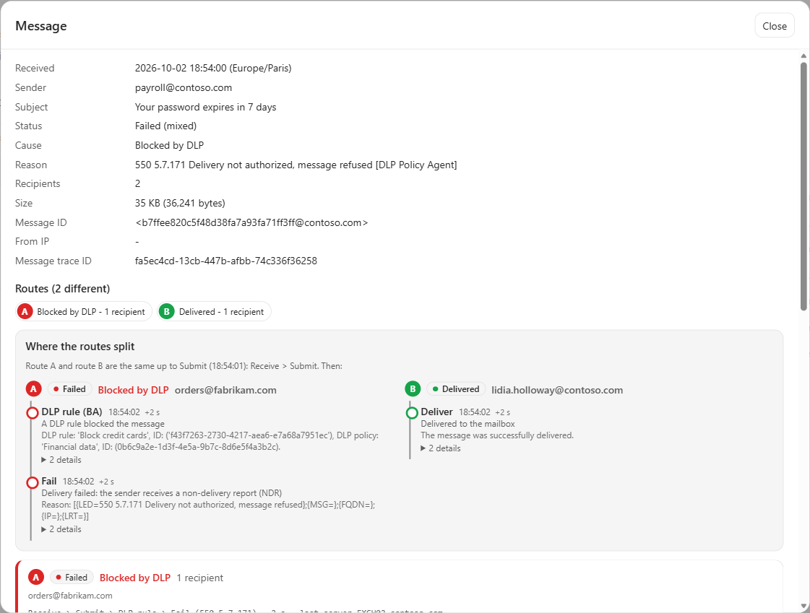

# Message Trace Report — Administrator guide

> Traces Exchange Online messages through the **Microsoft Graph message trace API** (v1.0), keeps them in a **local SQLite history**, and writes **CSV, JSON and HTML** reports. It sends the fewest requests the API allows, never wastes the tenant quota, and never asks twice for what it already holds.

> [!IMPORTANT]
> Files downloaded from the Internet may be blocked by Windows and fail to run. Before using this project, unblock every file in the downloaded folder:
>
> ```powershell
> Get-ChildItem "C:\Chemin\Du\Dossier" -Recurse -File -Force | Unblock-File
> ```
>
> Replace the example path with the folder where you downloaded or extracted this project.

```cards
search | What it reads | The message trace of Exchange Online, through Microsoft Graph — **read-only**, nothing else.
target | What it plans | One query per address of the shorter list, windows of up to 10 days, only what the database does not hold yet, within **100 requests per 5 minutes** for the tenant.
database | What it keeps | Every message and delivery in a local SQLite database: re-running a trace is immediate, and a scheduled collection keeps the history **beyond 90 days**.
file | What it leaves you | Messages, deliveries, senders and recipients as CSV (and JSON), and a self-contained HTML report with charts, search, the **route** of each message and the **cause** of each failure (blocked by DLP, by a mail flow rule, recipient not found, mailbox full…).
```

## Quick start

```steps
Register an application | Certificate, Microsoft Graph application permission `ExchangeMessageTrace.Read.All` with admin consent, and the service principal of the Microsoft message trace application (chapter 7).
Fill in the configuration | `config\MessageTraceReport.config.psd1`: `Tenant.TenantId`, `Authentication.AppId`, `Authentication.CertificateThumbprint`.
Trace | `.\Invoke-MessageTraceReport.ps1 -Sender john@contoso.com -Range Last7Days -Open`
Read the report | `reports\<date>_Trace\`: `MessageTrace.html` and the CSV files.
Optional: schedule the collection | `.\Invoke-MessageTraceReport.ps1 -Mode Collect` every day keeps the whole tenant beyond the 90 days of Graph (chapter 10).
```

# Part I · Understand

<!-- icon: book -->
## 1. Why this tool

Message trace is the first tool of every mail investigation: *did the message leave, who received it, why did it fail?* At scale, the questions become harder: *every message of 300 VIPs to Gmail last month*, *all failures towards a partner domain*, *the daily volume per sender*. The **Microsoft Graph message trace API** answers them without an Exchange Online PowerShell session, but it has strict rules — and a few behaviours the documentation does not tell.

This tool replaces `Invoke-MessageTraceGraph.ps1`, a script that already used the API in parallel. Measured in a lab tenant, that script:

- returned **only the last recipient** of a recipient list (the API ignores `or`), so most of the data was silently missing;
- sent **one query per address and per day**, with a fixed 9-second pause before each request — 17 minutes for 20 senders over 7 days;
- lost whole days on a single network error (no retry), and kept every row in memory (`+=` on arrays);
- used the beta endpoint and a client secret on the command line; and its secrets had expired.

```cards
target | Correct before fast | Graph keeps one value per property in `$filter`: the tool sends one value per query and applies the **full filter on the database**. The report is exact.
clock | The quota is the limit | 100 requests per 5 minutes per tenant, 5,000 rows per request. One rolling budget is shared by the workers — and by the next run.
database | Never twice | Every page is stored as it arrives. A period already collected (by the same query or a wider one) is not asked again; only the last hours, which may still change, are.
refresh | Restartable | Ctrl+C, a reboot or a network failure keeps what was received; the next run collects only the rest.
shield | Read-only, least privilege | One Graph permission, read-only. A certificate, no secret on disk. Nothing is changed in the tenant.
file | One entry point | One script, one configuration file, a log per day, exit codes for a scheduled task, the same look as the other tools of the series.
```

<!-- icon: flow -->
## 2. How it works

```flow
target | Filter and plan | one value per query, windows of 10 days
arrow | only | what is missing
download | Microsoft Graph | 90 requests / 5 min
arrow | page by page | stored at once
database | SQLite | messages + deliveries
arrow | full filter | local
file | Report | CSV · JSON · HTML
```

1. **Filter.** The command line (or the `Collect` section) gives senders, recipients, `*@domain`, subject, statuses, message IDs, IP addresses and the period. Address files (CSV or text) are read and every value is checked — all errors are reported at once.
2. **Plan.** The Graph API keeps **one value per property** (chapter 3). The planner chooses the queries:
   - senders **and** recipients: one query per value of the **shorter** list; the other list is applied on the database;
   - senders **or** recipients: one query per sender and one per recipient;
   - one sender and one recipient: one query with both;
   - single values (subject, IP, one status, one message ID) are added to every query;
   - several statuses or message IDs: one query each when there is no address, otherwise filtered on the database.
3. **Minus the database.** For each query, the periods already collected — by the same query, by a wider one (the whole tenant, a `*@domain` that includes the address, fewer conditions), and **settled** (`Collection.SettlingHours`, 4 h by default) — are removed. What is older than 90 days and not in the database is reported as unavailable.
4. **Windows.** What remains is cut into windows of at most 10 days, newest first. A query without address (the whole tenant, a subject) is cut into windows of 24 hours or less, so that several windows are read in parallel.
5. **Collection.** Up to `MaxConcurrency` workers send the requests through **one rolling-window limiter** (90 requests per 5 minutes by default). A 429 pauses every worker for the `Retry-After` time; a 401 renews the token; 5xx and network errors are retried. One writer thread stores each page in SQLite, in one transaction, and extends the coverage of its window: the API returns the newest messages first, so after each page the window is complete from just after its oldest message.
6. **Report.** The full filter is applied to the database (`Store.Select`), then one pass writes every file. Optionally the **route** of the deliveries is read first (`getDetailsByRecipient`, separate quota): every recipient of a small selection, otherwise the problems first with one delivered recipient of the same message to compare (chapter 9).

> [!NOTE]
> The quota is per **tenant**: other tools and administrators share it. The timestamps of the last 5 minutes of requests are saved in the database, so the next run on this computer starts with what is already used.

<!-- icon: search -->
## 3. What the Graph API really does

The API was measured in a lab tenant on 2026-10-02 (Annex C). Documented and observed behaviours:

| Topic | Behaviour | What the tool does |
|---|---|---|
| `or`, `in`, `ne`, `not` in `$filter` | **Accepted but ignored**: only the **last** value of each property is kept, everything is combined with AND. `(recipientAddress eq 'a' or recipientAddress eq 'b')` returns only `b`. | One value per property and per query; the full filter on the database. |
| `startswith` / `endswith` / `contains` on addresses | Ignored (all rows returned). | Never sent. |
| `senderAddress eq '*@contoso.com'` | Works (domain). Other patterns (`john*@...`) return nothing. | `*@domain` sent to Graph; other patterns in `-Mode Report` only. |
| `subject` | `eq`, `contains`, `startswith`, `endswith`, case-insensitive. | `-Subject` and `-SubjectMatch`. |
| `status`, `messageId`, `fromIP`, `toIP` | `eq`, one value. | Sent when single. |
| Period | `receivedDateTime ge … and receivedDateTime le …` (both bounds, `le` — not `lt`), at most **10 days**, start not older than **90 days** (00:00 UTC). | Windows of ≤ 10 days, start rounded down and end rounded up to the second. |
| Order and paging | Newest first, stable across pages; `$top` 1–5,000 (default 1,000); `@odata.nextLink`. `$select`, `$orderby`, `$count` are ignored. | `$top=5000`; partial coverage page by page. |
| Rows | One row per message **and recipient**; `id` (message trace ID) and `messageId` are one-to-one; `(id, recipientAddress)` is unique. Status, size and destination IP vary per recipient. | Tables `message` and `delivery`. |
| Quota | 100 requests / 5 minutes per tenant (rolling); 429 *Your recent queries have surpassed the permitted limit*. Route details: separate quota of the same size. | Shared limiter, Retry-After, saved timestamps. |
| Prerequisite | The service principal of the Microsoft application `8bd644d1-64a1-4d4b-ae52-2e0cbf64e373` (*Transport Data Platform*) must exist, else 401. | Clear error message (Annex A). |

<!-- icon: chart -->
## 4. Performance

A page of 5,000 rows takes 2 to 4 seconds (about 2 MB). Two or three concurrent requests therefore use the whole quota: **about 450,000 rows per 5 minutes, 5 million per hour**. Beyond that, nothing goes faster — what matters is the number of requests.

| Lab measure (2026-10-02) | Original script | Message Trace Report |
|---|---|---|
| 1 sender **and** 3 recipients, 7 days | 31.8 s — **120 rows, 1 recipient of 3** | **8.5 s** — 298 rows, 3 recipients, 2 requests |
| 20 senders, 7 days (558,945 deliveries) | 17 min 00 s — 550,529 rows, 2 requests lost | **6 min 22 s** — all rows, 118 requests, 0 throttled |
| The same, run again | 17 min | **27 s** (only the last 4 hours are read again) |
| Whole tenant, 30 busy minutes | — | 447,078 rows in 5 min 01 s (91 requests: the quota) |

**Database size.** About 60 bytes per delivery, messages and indexes included: the lab database holds 462,801 deliveries (27,506 messages) in 26 MB. A tenant with one million deliveries a day needs about 1.7 GB per month of history.

**Estimate before running.** The plan step prints the number of windows: each one is at least one request. Above `Throttling.MaxRequests`, the tool shows the minimum time imposed by the quota; above `Collection.MaxQueries` (2,000), it stops unless `-Force` is given.

# Part II · Set up

<!-- icon: checklist -->
## 5. Prerequisites

| Item | Requirement |
|---|---|
| Operating system | Windows 10 / 11 or Windows Server 2019 or later (x64 or ARM64) |
| PowerShell | **7.4** or later. Windows PowerShell 5.1 is not supported. |
| Modules | **None** in Certificate and ClientSecret modes. Interactive mode: `Microsoft.Graph.Authentication` (for MSAL only). |
| SQLite | Bundled in `lib\sqlite` (unmodified nuget.org binaries) — nothing to install. |
| Network | `https://login.microsoftonline.com` and `https://graph.microsoft.com` (system proxy used). |
| Permission | Microsoft Graph **`ExchangeMessageTrace.Read.All`** — application (certificate, secret) or delegated (interactive), with admin consent. |
| Tenant | Service principal of the application `8bd644d1-64a1-4d4b-ae52-2e0cbf64e373` (chapter 7). Global service only (not GCC High, DoD, 21Vianet). |
| Console | Windows Terminal recommended (colours and emoji); the classic console works with simple symbols. |

<!-- icon: download -->
## 6. Installation

1. Download the release zip from GitHub and extract it, for example to `C:\Tools\MessageTraceReport`.
2. Unblock the files (see the box at the top of this guide).
3. Edit `config\MessageTraceReport.config.psd1` (chapter 8).
4. Check the configuration without connecting: `.\Invoke-MessageTraceReport.ps1 -Mode Status`.

The tool creates, next to itself: `data\` (the SQLite database), `reports\` (one sub-folder per run), `logs\` (one file per day) and `bin\` (the engine, compiled from `src\Engine.*.cs` on first use and again only when a source file changes).

> [!WARNING]
> `data\`, `reports\` and `logs\` contain e-mail addresses and subjects. Restrict the NTFS permissions of the tool folder to the administrators who run it.

<!-- icon: key -->
## 7. Application registration

App-only with a certificate is recommended, for scheduled tasks and for interactive use alike.

```steps
Certificate | On the computer that runs the tool, for the account that runs it: `New-SelfSignedCertificate -Subject 'CN=MessageTraceReport' -CertStoreLocation Cert:\CurrentUser\My -KeyExportPolicy NonExportable -KeySpec Signature -KeyAlgorithm RSA -KeyLength 2048 -HashAlgorithm SHA256 -NotAfter (Get-Date).AddYears(2)`, then export the public key (`.cer`). Use `Cert:\LocalMachine\My` for a service account, or a certificate of your PKI.
Application | Microsoft Entra admin center > App registrations > New registration, single tenant. Note the application (client) ID and the tenant ID.
Certificate on the application | Certificates & secrets > Certificates > Upload the `.cer`. Note the thumbprint.
Permission | API permissions > Add > Microsoft Graph > **Application permissions** > `ExchangeMessageTrace.Read.All`, then **Grant admin consent**.
Message trace service principal | Once per tenant (Application Administrator): `Connect-MgGraph -Scopes Application.ReadWrite.All` then `New-MgServicePrincipal -AppId 8bd644d1-64a1-4d4b-ae52-2e0cbf64e373`. It appears as *Transport Data Platform*. Provisioning can take several hours (401 meanwhile).
Configuration | `Authentication.Mode = 'Certificate'`, `AppId`, `CertificateThumbprint`, and `Tenant.TenantId`.
```

The tool checks the token before the first request: the tenant must be `Tenant.TenantId` and the token must hold `ExchangeMessageTrace.Read.All` — otherwise it stops with the fix to apply.

**Other modes.**

- **ClientSecret** — kept for compatibility. The secret is read from the environment variable `Authentication.ClientSecretVariable` (`MTR_CLIENT_SECRET`), or typed at the prompt (hidden). It is never written by the tool. Microsoft recommends a certificate.
- **Interactive** — an administrator signs in (browser, MFA). Delegated permission `ExchangeMessageTrace.Read.All` on the client application: by default *Microsoft Graph Command Line Tools* (an administrator consents once), or your own public client application (`Authentication.AppId`, redirect URI `http://localhost`). Needs the `Microsoft.Graph.Authentication` module (MSAL).

<!-- icon: settings -->
## 8. Configuration

`config\MessageTraceReport.config.psd1` is a PowerShell data file. Relative paths are relative to the tool folder. Every value is checked at start; all problems are listed together.

| Section | Setting | Default | Meaning |
|---|---|---|---|
| Tenant | `TenantId` | — | Tenant ID (GUID). The tool stops if the token belongs to another tenant. |
| | `Organization` | `''` | Shown in the console and the report. |
| Authentication | `Mode` | `Certificate` | `Certificate`, `ClientSecret` or `Interactive`. |
| | `AppId` | — | Application (client) ID. Interactive: `''` = Microsoft Graph Command Line Tools. |
| | `CertificateThumbprint` | — | In `Cert:\CurrentUser\My` or `Cert:\LocalMachine\My`, with its private key. |
| | `ClientSecretVariable` | `MTR_CLIENT_SECRET` | Environment variable of the secret (ClientSecret mode). |
| | `UserPrincipalName` | `''` | Interactive: the expected account. |
| Collection | `PageSize` | 5000 | Rows per request (1–5,000). |
| | `MaxConcurrency` | 3 | Requests in flight. 2–3 use the whole quota. |
| | `WindowHours` | 240 | Longest window of a query (Graph: 10 days). |
| | `BroadWindowHours` | 24 | Window of a query without address (whole tenant, subject only). |
| | `SettlingHours` | 4 | The last hours of a collection are read again by the next run (status changes, late rows). |
| | `MaxQueries` | 2000 | A plan above this number of requests stops (`-Force` runs it). |
| | `RequestTimeoutSeconds`, `MaxRetries` | 180, 5 | Per request; 429 waits are counted apart. |
| | `SourceHistoryDays` | 90 | History kept by Graph. |
| Throttling | `MaxRequests`, `PeriodSeconds` | 90, 300 | The rolling budget of the tool. Microsoft: 100 per 5 minutes — keep a margin for the other tools. |
| Details | `Enabled`, `MaxDeliveries` | `False`, 100 | Route and cause of the deliveries (`-IncludeDetails`, `-MaxRoutes`). One request per delivery, read once. A selection of at most `MaxDeliveries` is read completely. |
| | `OnlyProblems`, `CompareWithDelivered` | `True`, `True` | Beyond `MaxDeliveries`: only the deliveries not delivered, plus one delivered recipient of each partly delivered message (to see where the routes split). |
| | `ConsoleMessages` | 3 | A selection of at most this many messages shows its routes in the console. |
| Collect | `Days` | 2 | `-Mode Collect`: how far back each run checks. |
| | `Senders`, `Recipients`, `SenderFile`, `RecipientFile`, `Operator` | empty, `Or` | Scope of the collection. Empty = the whole tenant. |
| Storage | `DatabasePath` | `.\data\MessageTraceReport.sqlite` | The history. |
| | `RetentionDays` | 180 | Deleted by `-Mode Collect` (0 = keep everything). |
| Report | `DefaultRange` | `Last48Hours` | When no period is given. |
| | `TimeZone` | `Europe/Paris` | Dates and days of the reports. |
| | `OutputPath`, `FilePrefix` | `.\reports`, `MessageTrace` | One sub-folder per run. |
| | `Formats`, `Files` | `Csv`, `Html`; all five files | `Json` also available; `Messages`, `Deliveries`, `Senders`, `Recipients`, `Routes` (written when routes were read). |
| | `CountsPerDay` | `$true` | Senders and recipients counted per day when the period is longer than a day. |
| | `CsvDelimiter` | `;` | Opens directly in Excel with French regional settings. |
| | `MaxRowsPerFile` | 1,000,000 | A CSV file is continued in `_part2`, `_part3`… |
| | `HtmlMaxMessages`, `HtmlRecipientsPerMessage` | 200,000, 100 | The HTML table keeps the newest messages; totals and charts count all of them. |
| | `OpenReport` | `$false` | Open the HTML file at the end (or `-Open`). |
| Logging | `Path`, `RetentionDays` | `.\logs`, 30 | One file per day. |

# Part III · Use

<!-- icon: play -->
## 9. Tracing messages

`-Mode Trace` is the default: the tool collects what the database lacks for the filter and the period, then writes the report.

```powershell
# One sender, last 48 hours (Report.DefaultRange)
.\Invoke-MessageTraceReport.ps1 -Sender john@contoso.com

# Failed messages to a partner domain over 7 days, report opened at the end
.\Invoke-MessageTraceReport.ps1 -Recipient *@fabrikam.com -Status Failed -Range Last7Days -Open

# A list of VIPs (CSV, column detected) to Gmail in September
.\Invoke-MessageTraceReport.ps1 -SenderFile .\vip.csv -Recipient *@gmail.com -Start 2026-09-01 -End 2026-10-01

# From OR to these addresses, with the route of the failed deliveries
.\Invoke-MessageTraceReport.ps1 -Sender alerts@contoso.com -Recipient helpdesk@contoso.com -Operator Or -IncludeDetails

# A subject, a message ID, a source IP
.\Invoke-MessageTraceReport.ps1 -Subject 'Invoice' -SubjectMatch StartsWith -Range Today
.\Invoke-MessageTraceReport.ps1 -MessageId '<CAJ1234@mail.contoso.com>' -Range Last30Days
.\Invoke-MessageTraceReport.ps1 -FromIP 203.0.113.25 -Range Yesterday
```



**Periods.** `-Range Last24Hours | Last48Hours | Last7Days | Last10Days | Last30Days | Last90Days | Today | Yesterday`, `-Date 2026-09-28` (one day), or `-Start` / `-End` (`yyyy-MM-dd`, `'yyyy-MM-dd HH:mm'` in the report time zone, or ISO 8601 with an offset). `-End` defaults to now. Periods longer than 10 days are cut automatically.

**Addresses.** Exact SMTP addresses or `*@domain`, several values separated by commas, from `-SenderFile` / `-RecipientFile` (`.csv` with a column `Email`, `PrimarySmtpAddress`, `Address`, `Mail`… or `-FileColumn`; `.txt` one per line, `#` for comments).

**What the plan step tells.** The filter, the strategy (which list is sent to Graph and which is applied locally), what the database already holds, and the number of windows to collect. Running the same trace again collects only the last `SettlingHours`:



**Other switches.** `-Format Csv,Html,Json`, `-OutputPath`, `-GridView` (the messages in Out-GridView), `-Refresh` (collect again what the database holds), `-Force` (above `MaxQueries`), `-ConfigPath`.

> [!TIP]
> A long investigation over many addresses can be interrupted with **Ctrl+C**: the pages already received are kept. Run the same command again to continue.

### Why a message was not delivered

The message trace gives the **status** of each recipient (Delivered, Failed, Pending, Quarantined…). `-IncludeDetails` also reads the **route** of the deliveries (`getDetailsByRecipient`: Receive, Submit, DLP rule, Transport rule, Spam, Expand, Defer, Fail, Deliver…) and tells, for each recipient not delivered, **the cause**, the status code, the rule or the component that decided, the remote server, and where its route left the route of the recipients who received the message.

```powershell
# One message: every recipient, grouped by identical route, in the console and the report
.\Invoke-MessageTraceReport.ps1 -MessageId '<CAJ1234@mail.contoso.com>' -Range Last10Days -IncludeDetails

# Failures of a sender over 7 days: up to 300 routes (default 100, Details.MaxDeliveries)
.\Invoke-MessageTraceReport.ps1 -Sender payroll@contoso.com -Range Last7Days -MaxRoutes 300 -Open
```


**Which routes are read.** One request per delivery, on a quota of its own (100 per 5 minutes). A selection of at most `Details.MaxDeliveries` deliveries (100) is read completely. A larger one is read newest message first: for each message with a problem, one recipient of each problem status and — when other recipients received it — **one delivered recipient to compare** (`CompareWithDelivered`); then the other problems; the delivered ones only with `OnlyProblems = $false`. A route is read once: the next runs reuse it from the database (until the status of the delivery changes).

**Grouping and split.** The recipients of a message that followed the same steps with the same result share a route (*Route A*, *Route B*…), problems first. When some recipients failed and others were delivered, the report shows the steps the routes have in common and, side by side, what happened next — for example *the same up to the DLP rule, then Fail 5.7.171 for route A, Deliver for route B*.

**Causes.** Each route not ending in the inbox gets a cause, in plain words:

| Cause | Decided from |
|---|---|
| Blocked by DLP | Component *DLP Policy Agent*, a *DLP rule* step with a blocking action (`BA`), 5.7.171 (seen in the lab) |
| Blocked by mail flow rule (ETR) | Component *Transport Rule Agent*, `TRANSPORT.RULES.RejectMessage`, codes 5.7.900–5.7.999 (reserved for mail flow rules) |
| Deleted / Quarantined by mail flow rule (ETR) | A *Transport rule* step that deletes or quarantines |
| Blocked by organization policy | 5.7.1 *Delivery not authorized, message refused* — the default text of both DLP and mail flow rules — when the route does not say which one |
| Blocked by Tenant Allow/Block List | 5.7.703 |
| Blocked: malware, Quarantined: malware | A *Malware* step |
| Quarantined: spam or phishing, Junk Email folder, Blocked as spam or phishing | A *Spam* step (SCL, SFV) and the folder of the delivery |
| Recipient not found | 5.1.1, 5.1.10, 5.4.1 (directory-based edge blocking), `RESOLVER.ADR` |
| Mailbox full | 5.2.2 |
| Sender not allowed by recipient | `RESOLVER.RST` (delivery restrictions, moderation), 5.7.12, 5.7.13, 5.7.124, 5.7.133–5.7.136 |
| Sender authentication failed | 5.7.23 (SPF), 5.7.509 (DMARC), 5.7.25, 5.7.26 |
| Sending limit exceeded, Sender or IP blocked | 5.2.121, 5.2.122, 4.3.2, 5.7.232–5.7.236; 5.1.8, 5.7.501–5.7.513, 5.7.606–5.7.649, 5.7.700–5.7.750 |
| External forwarding blocked, Relay denied, Routing loop | 5.7.520; 5.7.64, 5.7.57, 5.7.367; 5.4.6–5.4.20 |
| Destination server unreachable, TLS or certificate problem, Expired in queue | 4.4.x, 5.4.4, 5.4.316; 5.7.321–5.7.325; 4.4.7, 5.4.300 |
| Recipient not found / Mailbox full (remote server), Rejected by remote server | The answer of the recipient's server (outbound messages) |
| Message size or format, Delayed (retrying), Dropped without NDR, Other failure | 5.3.4, 5.6.x; a *Defer* step; a *Drop* step; anything else (the status code is always shown) |

The status codes link to their page of [Email non-delivery reports and SMTP errors in Exchange Online](https://learn.microsoft.com/exchange/mail-flow-best-practices/non-delivery-reports-in-exchange-online/non-delivery-reports-in-exchange-online).

> [!TIP]
> **Finding the rule.** The route names the DLP or mail flow rule, or gives its ID when the names are empty: `Get-TransportRule | Where-Object { "$($_.Guid)" -eq '<id>' -or "$($_.ImmutableId)" -eq '<id>' }` (Exchange Online PowerShell), `Get-DlpComplianceRule | Where-Object { "$($_.Guid)" -eq '<id>' -or "$($_.ImmutableId)" -eq '<id>' }` (Security & Compliance PowerShell).

<!-- icon: calendar -->
## 10. Scheduled collection

`-Mode Collect` reads the last `Collect.Days` days of the whole tenant (or of the `Collect` scope) into the database — only what is missing and the last hours — then applies the retention. Scheduled every day, it keeps the history **beyond the 90 days of Graph**, and every trace of that period is then answered from the database.



```powershell
$action  = New-ScheduledTaskAction -Execute 'pwsh.exe' -Argument '-NoProfile -File "C:\Tools\MessageTraceReport\Invoke-MessageTraceReport.ps1" -Mode Collect' -WorkingDirectory 'C:\Tools\MessageTraceReport'
$trigger = New-ScheduledTaskTrigger -Daily -At 02:30
Register-ScheduledTask -TaskName 'Message Trace Report - Collect' -Action $action -Trigger $trigger -User 'CONTOSO\svc-mtr' -Password (Read-Host 'Password') -RunLevel Limited
```

The account of the task must hold the certificate (in its `CurrentUser\My`, or `LocalMachine\My` with read access to the private key). Colours are disabled when the output is redirected; the log holds everything. Exit code 2 means *finished but incomplete* (a window failed, or part of the period is older than 90 days and not in the database).

> [!NOTE]
> A busy tenant (one million deliveries a day) needs about 200 requests a day, about 12 minutes with the quota. A first collection of 10 days needs ten times more: run it once by hand with `Collect.Days = 10`.

<!-- icon: database -->
## 11. Reports from the database, and the status

`-Mode Report` writes the report from the database only — no connection, no quota. It accepts any pattern in addresses (`'sales-*@contoso.com'`). When the period is not completely in the database for this filter, the console and the report say how much is (`coverage`), and the exit code is 2.

```powershell
.\Invoke-MessageTraceReport.ps1 -Mode Report -Range Last30Days -Sender 'sales-*@contoso.com'
.\Invoke-MessageTraceReport.ps1 -Mode Status
```

`-Mode Status` shows the database (size, messages, deliveries, distinct queries), day by day the collection of the scope (complete, refreshed at the next run, partial, beyond the Graph history) and the last runs.



<!-- icon: chart -->
## 12. Reading the reports

Each run writes a folder `reports\<yyyy-MM-dd_HHmmss>_<Mode>\`:

| File | One row per | Columns |
|---|---|---|
| `MessageTrace_Messages.csv` | message | Received, Sender, Recipients, Recipient count, Status (`Delivered`, or `Delivered 24, Failed 2`), Subject, Size, Message ID, From IP, Message trace ID, Cause, Reason (of the worst recipient whose route was read) |
| `MessageTrace_Deliveries.csv` | message and recipient | Received, Sender, Recipient, Status, Subject, Size, Message ID, From IP, To IP, Message trace ID — what Graph returns — then Route (`Receive > Submit > Fail (550 5.1.10)`), Cause (`Blocked by DLP (rule 'Block credit cards')`) and Reason (`550 5.7.171 Delivery not authorized, message refused [DLP Policy Agent]`) when the route was read |
| `MessageTrace_Routes.csv` | step of a route read | Received, Sender, Recipient, Status, Cause, Subject, Step, Time, Elapsed (s), Event, Action, Detail, Status code, Reason, Component, Remote server, Facts (server, connector, TLS, SCL…), Message ID, Message trace ID |
| `MessageTrace_Senders.csv` | sender (and day) | Date, Sender, Messages, Recipients, Delivered, Failed, Other, Last message |
| `MessageTrace_Recipients.csv` | recipient (and day) | Date, Recipient, Messages, Delivered, Failed, Other, Last message |
| `MessageTrace_Messages.json`, `_Deliveries.json` | (option `Json`) | Graph property names (`id`, `messageId`, `receivedDateTime`, `senderAddress` …); when the route was read: `route`, `outcome`, `causeId`, `cause`, `reason` and the `events` as Graph returns them |
| `MessageTrace.html` | — | The report below |

CSV files are UTF-8 with BOM, `;` by default, and a cell starting with `= + - @` is prefixed with `'` so that Excel never runs it as a formula. The columns added in 1.1.0 are at the end: scripts reading the 1.0 files by name or position keep working.

The HTML report is one self-contained file (the data is compressed inside): tiles, delivery status, messages over time (failures in red), top 10 senders and recipients (click to filter), **why deliveries were not delivered** (one card per cause, then the status codes, with their Microsoft Learn page — click to filter), and a table that stays fast with 200,000 messages — search (reasons included), filters by sender, recipient, subject, status, **cause**, *partly delivered*, dates and Message ID, sort, export of the view. With routes, the table has a **Cause** column.



A click on a message opens its recipients and, when it was read, the **route**: recipients grouped by identical route, *where the routes split* (common steps, then the failed and the delivered recipient side by side), for each route the cause, the rule, the status code with its meaning and its page, the component, the remote server, and every step with its time, the time since the first step and its details (server, connector, TLS, spam verdict…).



<!-- icon: terminal -->
## 13. Exit codes, files and logs

| Exit code | Meaning |
|---|---|
| 0 | Success. |
| 1 | Failure: configuration, filter, sign-in, permission, database. Nothing or part of the work was done; the summary gives the error. |
| 2 | Finished but incomplete: a window failed, the run was interrupted, or part of the period is not available. |

Logs: `logs\MessageTraceReport_<yyyyMMdd>.log`, one line per event, every 60 seconds the progress of a long collection, the Graph errors with their message. The database keeps the last runs (`-Mode Status`).

<!-- icon: undo -->
## 14. Migrating from Invoke-MessageTraceGraph.ps1

| Invoke-MessageTraceGraph.ps1 | Message Trace Report |
|---|---|
| `-TenantId -ClientId -ClientSecret` | `Tenant` and `Authentication` sections (certificate recommended; secret from an environment variable) |
| `-StartDate -EndDate` (≤ 10 days) | `-Start -End` (aliases `-StartDate -EndDate`), any length within 90 days — or beyond, from the database; or `-Range` |
| `-Senders -Recipients` | `-Sender -Recipient` (aliases kept); `*@domain` accepted |
| `-SendersCsv -RecipientsCsv -CsvEmailColumn` | `-SenderFile -RecipientFile -FileColumn` (aliases kept); CSV or text, column detected |
| `-OperatorOr` | `-Operator Or` |
| `-Subject` (`eq`) | `-Subject` with `-SubjectMatch Contains` (default), `StartsWith`, `EndsWith`, `Equals` |
| `-Mode Detail / CountBySender / CountByRecipient` | All produced at once: `Messages`, `Deliveries`, `Senders`, `Recipients` (per day when the period is longer than a day) |
| `-Properties` | Fixed columns; JSON keeps the Graph names |
| `-OutputFormat CSV / JSON`, `-OutputFolder`, `-OutputFileName` | `-Format`, `-OutputPath`, `Report.FilePrefix` |
| `-ShowGridView` | `-GridView` |
| `-PageSize -SimultaneousThreads -MaxRequestsLimit -RateLimitWindowMins` | `Collection.PageSize`, `Collection.MaxConcurrency`, `Throttling.MaxRequests`, `Throttling.PeriodSeconds` |

> [!CAUTION]
> Results of the old script with several recipients in AND mode, or with `-OperatorOr` and several values, were incomplete: Graph kept only the last recipient. Run the investigation again with this tool.

# Part IV · Maintain

<!-- icon: layers -->
## 15. Inside the tool

| File | Role |
|---|---|
| `Invoke-MessageTraceReport.ps1` | Entry point: parameters, modes, steps, summary, exit code |
| `MessageTraceReport.psm1` / `.psd1` | Module: loads `src\*.ps1` |
| `src\Console.ps1` | Banner, steps, items, live progress line, tables, summary card, log |
| `src\Configuration.ps1` | `Import-MtrConfiguration`: defaults, checks, absolute paths |
| `src\Engine.ps1` | Loads SQLite and compiles the C# engine into `bin\` |
| `src\Filter.ps1` | Periods, address files, filter checks, query plan, work plan |
| `src\Connection.ps1` | Token: certificate (client assertion), secret, interactive (MSAL); checks tenant and permission; renewal |
| `src\Collection.ps1` | Runs the engine with the progress loop, prints its events, Ctrl+C |
| `src\Report.ps1` | Selection and report files |
| `src\Route.ps1` | The route of a message and the causes in the console |
| `src\Status.ps1` | Status, retention, lock |
| `src\Engine.Common.cs` | Time ranges, coverage arithmetic, addresses, CSV safety |
| `src\Engine.Plan.cs` | `FilterSpec`, `Condition`, `QuerySpec`, `Planner` (queries, coverage reuse, windows) |
| `src\Engine.Graph.cs` | `RateLimiter`, `TokenSlot`, `GraphClient` (retries), `Collector`, `DetailCollector` |
| `src\Engine.Store.cs` | SQLite schema, page ingestion, coverage, selection, routes to read, statistics, purge |
| `src\Engine.Route.cs` | `RouteAnalyzer`: steps of a route, facts of the XML data, reason (codes, remote server, Learn page), **cause**, grouping of recipients (`Journeys`) |
| `src\Engine.Report.cs` | CSV (parts), JSON, HTML (compressed chunks), aggregates, causes |
| `templates\Report.template.html` | The HTML page: edit texts, colours, columns — no rebuild |

**Database.** `address` and `status` (dictionaries), `message` (one row per message trace ID: Message-ID, sender, subject, received, source IP), `delivery` (message × recipient: status, size, destination IP, last update), `signature` (one row per distinct Graph query, as sorted conditions), `coverage` (`[start, end)` collected for a signature, with the collection time), `detail` / `detail_fetch` (routes), `run`, `metadata`. Times are Unix milliseconds UTC.

**Adding a filter property.** `FilterSpec` and `Planner.Plan` (Engine.Plan.cs), `Store.Select` (the SQL), `New-MtrFilter` (checks), the parameter of the entry script, the tests.

**Adding a cause.** The `Causes` table (id, label, tone, help) and `ByReason` / `FindCause` in `Engine.Route.cs` — the order of the checks matters (policies, network, remote server, then codes) — and a line of the test *names the cause of each failure* or *reads the cause from the code*.

<!-- icon: beaker -->
## 16. Testing a change

```powershell
Invoke-Pester -Path .\tests -Output Detailed      # Pester 5+, no connection to Microsoft 365
.\tests\New-DemoReport.ps1 -Open                  # a report of fictitious Contoso data
```

The tests use `tests\FakeGraph.cs`, an in-memory message trace API that behaves like the real one (one value per property, newest first, paging, 10 days, 90 days) and fails on demand (429 with Retry-After, 401, 500, 403, missing service principal). They cover the configuration, the periods, the filter, the planner and the coverage reuse, the limiter, the collection with its failures and its interruption, the report files and the entry script.

# Annexes

<!-- icon: lifebuoy -->
## Annex A — Troubleshooting

| Symptom | Cause and fix |
|---|---|
| `401 … Service principal-less authentication failed … 8bd644d1-…` | The *Transport Data Platform* service principal is missing, or provisioning is not finished (up to several hours). Chapter 7, step 5. |
| `The application has no application permission ExchangeMessageTrace.Read.All` | Permission not added or admin consent not granted. A new consent can take a few minutes to reach the token. |
| `403 Permission denied` | Same as above, or the delegated account has no right on message trace. |
| `AADSTS700027` | The certificate is not on the application, or another thumbprint. |
| `AADSTS7000222` | The client secret has expired. Move to a certificate. |
| `AADSTS700024` | The clock of the computer is wrong. |
| `Certificate … not found` | Imported for another account, or without its private key (`.cer` instead of `.pfx`). |
| Many `Throttled by Microsoft Graph (429)` | Another tool uses the quota of the tenant. Lower `Throttling.MaxRequests`; the tool waits and goes on. |
| `request refused (400) - … older than 90 days` | The window starts before the Graph history: the period is reported as not available. |
| `The plan needs N requests` | More than `Collection.MaxQueries`: narrow the filter, or `-Force`. |
| `Another execution is already collecting` | The scheduled task runs on the same database: wait, or `-Mode Report`. |
| Coverage below 100% in `-Mode Report` | The database does not hold the whole period for this filter: run the trace without `-Mode Report`. |
| The HTML page stays on *Loading* | Old browser without `DecompressionStream`: use a recent Edge, Chrome or Firefox, or the CSV files. |
| Cause *Blocked by organization policy* | 5.7.1 *Delivery not authorized, message refused* without the component or the rule step: a DLP or mail flow rule with the default text. Open the route: the *DLP rule* / *Transport rule* steps give the candidates. |
| *Routes: nothing new to read* | The routes of the selection are already in the database (they are read once), or the selection holds only delivered messages beyond `MaxDeliveries` (`OnlyProblems`). |
| Few routes read on a large selection | `Details.MaxDeliveries` (100) or `-MaxRoutes`: the problems of the newest messages are read first. |
| `Get-TransportRule` finds no rule with the ID of the route | The rule was deleted or renamed since; message trace keeps the ID it had at the time. |

<!-- icon: link -->
## Annex B — Microsoft Graph calls

| Call | When |
|---|---|
| `POST https://login.microsoftonline.com/{tenant}/oauth2/v2.0/token` | Token (client credentials with a client assertion or a secret), renewed 5 minutes before expiry or after a 401 |
| `GET /v1.0/admin/exchange/tracing/messageTraces?$filter=…&$top=5000` | Every window, then `@odata.nextLink` |
| `GET /v1.0/admin/exchange/tracing/messageTraces/{id}/getDetailsByRecipient(recipientAddress='…')` | `-IncludeDetails` / `-MaxRoutes` only, once per delivery (separate quota) |

Every request carries a `client-request-id` and the `User-Agent` `MessageTraceReport/<version>`; responses are compressed (gzip / brotli).

<!-- icon: check -->
## Annex C — Lab validation (2026-10-02)

Lab tenant with about 4,200 shared mailboxes and two DLP load tests (150,000 and 200,000 messages, mostly to 32 recipients each). Existing application *MessageTraceGraph*, certificate added (its two secrets had expired). Results:

- API behaviour of chapter 3: 120 probe requests, evidence kept in the lab folder.
- Traces of 1, 2, 3 and 20 addresses, AND / OR, `*@domain`, status, subject, routes — compared with the patched original script (chapter 4).
- Whole tenant, 30 busy minutes: 447,078 deliveries in 5 min 01 s, 91 requests, no 429; database 26 MB.
- `-Mode Collect` (2 days), `-Mode Status`, `-Mode Report` with patterns; interruption (Ctrl+C) and resume.
- Routes (1.1.0): a message to 25 recipients, one failed *554 5.2.2 mailbox full*, 24 delivered by two routes — split after the DLP rule; 66 recipients blocked by DLP (*550 5.7.171*, *DLP Policy Agent*, rule ID); a delay *450 4.4.317* towards the on-premises hybrid server; a quarantine (SCL 8, SFV SPM); a distribution group expansion. Events of the same second come back unordered (Fail before the DLP rule that caused it): they are ordered by step. Mail flow rule rejections were not produced in the lab: their signatures come from the Microsoft documentation and are covered by the tests.
- 59 Pester tests.

<!-- icon: tag -->
## Annex D — Versioning and release checklist

```steps
Version | `ModuleVersion` in `package\MessageTraceReport.psd1`, `$script:ToolVersion` in the psm1, the `Version` lines of the file headers, the front matter of this guide, `CHANGELOG.md`.
Tests | `Invoke-Pester -Path .\tests` — all green.
Guide | `.\tools\Build-Documentation.ps1`, then `.\tools\New-ReadmeImages.ps1`.
Package | `.\tools\New-MtrPackage.ps1` — the configuration is emptied of tenant values and checked.
Release | Tag `vX.Y.Z`, release notes from `CHANGELOG.md`, the zip of the package.
```
